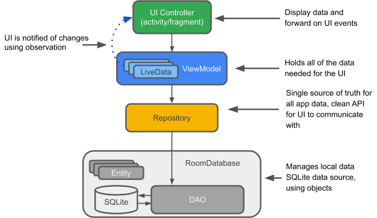

# 2020 java小学期大作业 实验报告

李炳睿 2018013391

翟明书 2018013425

## 综述

本次java小学期的大作业是新冠肺炎疫情APP。通过调用助教提供的后端数据接口，实现了一个展示新冠新闻、疫情数据、知识图谱、知疫学者、新闻聚类等元素的Android客户端。

其中客户端部分使用java编写，聚类部分使用python编写并将结果导入至客户端中。

## 代码结构

我们将客户端划分结构为前端UI和后端本地数据库两个部分。使用UI+ViewModel+Room database实现，具体结构如下图所示：

前端和后端通过ViewModel解耦合，使开发变得更加高效、可扩展。同时，使用ViewModel还有两个好处：

- ViewModel的生命周期比单个Activity长，可以贯穿整个程序的运行过程。下图以屏幕旋转为例，展示了ViewModel的生命周期。

- 配合Livedata使用时，前后端的交互十分方便，UI只需要申请一个observer即可获得后端数据库的查询结果。下图展示了MainActivity通过申请Observer查询Room数据库的过程。

另外，在ViewModel层和Room数据库间我们还抽象了一个Repository层，这样设计的理由是：由于要从远端服务器读取数据，并实现数据的本地存储，我们需要一个层次来统筹管理网络访问和本地存储。因此，在Repository层中，我们使用了room数据库的Dao接口进行类SQL语句的查询；通过调用RemoteServiceManager类实现网络请求（使用httpURLconnection实现）。

作业分工上，李炳睿负责实现UI前端设计，翟明书负责后端数据库、网络访问的编写。另外，翟明书实现了新闻聚类算法的python实现，李炳睿在客户端中对其进行了结果展示。

## 具体实现

### 前端部分

TODO here

### 后端部分

后端部分主要包括Room数据库的构建和通过URL进行的网络访问。下面 ，以各个功能为序依次对后端逻辑进行介绍。

#### 疫情新闻

需要实现一个以发布时间为序的新闻列表，并完成上拉刷新（查看是否有新发布的新闻）、下拉刷新（查看更老的新闻）、历史记录（看过详情的新闻）、按照"news"和"paper"分类查看的功能。

为了节省客户端的存储空间、更加符合真实新闻客户端的逻辑，我们**没有一开始就拉取所有新闻**，而是根据用户的需求，分为“上拉”和“下拉”两种类别的更新。当用户希望上拉时，我们将从远端依次读取page=1,2,3...直到读取的新闻和本地存在的新闻有重复，这说明我们已经将所有新的新闻获得了。当用户希望下拉时，我们将从上次读取的末页开始依次往后读，直到获得未在本地存储的一页“老“新闻，需要这样获得老新闻的原因是：远端服务器新数据入库后页号发生变化，单纯读取某一页的话可能出现重复或遗漏新闻。

将每一条新闻作为存入数据库的基本单位，由于ROOM数据库是构建在SQLite之上的，我们可以很方便的通过一些SQL语句获得想要的数据子集。例如，根据新闻的type查询可以读取news或者paper；根据新增的属性watched（用户是否查看过详情）查询可以获得历史记录列表。

### 新闻聚类

TODO here

## 总结与心得

### 李炳睿的总结与心得

TODO here

### 翟明书的总结与心得

TODO here
