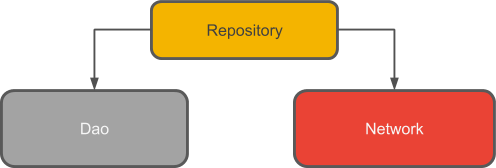

# 2020 java小学期大作业 实验报告

李炳睿 2018013391

翟明书 2018013425

## 综述

本次java小学期的大作业是新冠肺炎疫情APP。通过调用助教提供的后端数据接口，实现了一个展示新冠新闻、疫情数据、知识图谱、知疫学者、新闻聚类等元素的Android客户端。本作业完成了作业要求中的全部基础功能和拓展功能。

此外，客户端部分使用java编写，聚类部分使用python编写并将结果导入至客户端中。

## 代码结构

我们将客户端划分结构为前端UI和后端本地数据库两个部分。使用UI+ViewModel+Room database实现，具体结构如下图所示：

前端和后端通过ViewModel解耦合，使开发变得更加高效、可扩展。同时，使用ViewModel还有两个好处：

- ViewModel的生命周期比单个Activity长，可以贯穿整个程序的运行过程。下图以屏幕旋转为例，展示了ViewModel的生命周期。

- 配合Livedata使用时，前后端的交互十分方便，UI只需要申请一个observer即可获得后端数据库的查询结果。下图展示了MainActivity通过申请Observer查询Room数据库的过程。

另外，在ViewModel层和Room数据库间我们还抽象了一个Repository层，这样设计的理由是：由于要从远端服务器读取数据，并实现数据的本地存储，我们需要一个层次来统筹管理网络访问和本地存储。因此，在Repository层中，我们使用了room数据库的Dao接口进行类SQL语句的查询；通过调用RemoteServiceManager类实现网络请求（使用httpURLconnection实现）。

作业分工上，李炳睿负责实现UI前端设计，翟明书负责后端数据库、网络访问的编写。另外，翟明书实现了新闻聚类算法的python实现，李炳睿在客户端中对其进行了结果展示。

## 具体实现

### 前端部分

前端部分的工作主要是通过各种不同的形式展示数据，包括单一文本，列表，图表等，以及与用户交互的UI逻辑。以下从各个功能展开进行介绍。

#### 分类列表

我们选择将分类列表以及各个列表中的数据都放入MainActivity中，整个这些布局成为一个大的Fragment，其中每个类别又通过一个小的Fragment来表示视图；外层Fragment与多个内层Fragment的关系即是分类列表，通过ViewPager2+FragmeStateAdapter来实现。

点击右侧的TYPE按钮，我们进入到编辑类别的界面，这里是通过自定义继承了GridLayout类，达到两个Layout之间元素的一致变换；添加删除的动画原本想通过Fragment的工作栈，两个Fragment的通信协议以及Transition来实现，但没有达到文档中的效果。

#### 新闻列表
由上文所说，整个列表被嵌入一个fragment。新闻列表的主体由 RecyclerView 实现，此视图通过一个Adapter将容器与数据相连，此外其他很多与列表相关的功能基本都通过RecyclerView来实现。

点击新闻列表中的一项新闻，我们可以进入新闻详情页面。这个过程利用了不同Fragment间的通信，而这里的通信方式是通过接口来实现的，在内层Fragment中定义点击事件监听借口并包含一个成员变量，在外层则实现该接口，从而达到通过具体视图的监听调用外部Fragment的方法。

此外，我们可以在新闻列表界面上拉和下拉获取更多新闻，这里是通过第三方库来实现的。

此外，聚类，知疫学者与知识图谱等功能的逻辑是类似的，在此不再赘述。

#### 搜索新闻，分享与查看历史

最上方的搜索由SearchView来实现，右上方的查看历史由OptionMenu以及相应监听函数实现，分享使用Android原生功能通过Intent来实现。

#### 疫情数据可视化

疫情数据的折线图通过第三方库MPAndroidChart实现，通过改写了坐轴的格式器使得能够以日期为横坐标，为Chart设置一些参数使它能更美观。

### 后端部分

后端部分主要包括Room数据库的构建和通过URL进行的网络访问。下面 ，以各个功能为序依次对后端逻辑进行介绍。

#### 疫情新闻

需要实现一个以发布时间为序的新闻列表，并完成上拉刷新（查看是否有新发布的新闻）、下拉刷新（查看更老的新闻）、历史记录（看过详情的新闻）、按照"news"和"paper"分类查看的功能。

为了节省客户端的存储空间、更加符合真实新闻客户端的逻辑，我们**没有一开始就拉取所有新闻**，而是根据用户的需求，分为“上拉”和“下拉”两种类别的更新。当用户希望上拉时，我们将从远端依次读取page=1,2,3...直到读取的新闻和本地存在的新闻有重复，这说明我们已经将所有新的新闻获得了。当用户希望下拉时，我们将从上次读取的末页开始依次往后读，直到获得未在本地存储的一页“老“新闻，需要这样获得老新闻的原因是：远端服务器新数据入库后页号发生变化，单纯读取某一页的话可能出现重复或遗漏新闻。

将每一条新闻作为存入数据库的基本单位，由于ROOM数据库是构建在SQLite之上的，我们可以很方便的通过一些SQL语句获得想要的数据子集。例如，根据新闻的type查询可以读取news或者paper；根据新增的属性watched（用户是否查看过详情）查询可以获得历史记录列表。

对于新闻搜索，采用了混合策略：1.基础查询方式：拉去最新的200条新闻，并从标题和正文中进行关键词匹配。2.通过知识图谱查询：通过关键词查询知识图谱，根据各相关知识图谱实体获得相关新闻。

#### 疫情数据

需要根据不同的维度查询疫情数据。首先是关于地区的存储，在助教提供的数据里，地区名共有三个层次:Country|Province|County。后端需要实现的第一个逻辑便是地区的选择。首先选择Country,根据选择结果生成对应的Province列表；然后选择Province,根据选择的(Country,Province)生成对应的County列表。这些操作都通过SQL语句实现了。这样设计的好处是，用户输入的（Country,Province,County)三元组一定是合法的，同时也让用户选择时有更好的层次体验。

接下来是关于数据，将每个地区（国家、省份、城市的三元组）的数据作为元素存储在数据库中。用SQL语句实现了时间段、时间点疫情数据的查询。

唯一美中不足的是，由于数据量较大导致了初始化数据库的时间较长，使得在客户端刚开始运行时需要等待若干秒，才能正常访问疫情数据。

#### 疫情图谱

疫情图谱在代码逻辑上和疫情新闻十分类似：将每个实体作为基本单元，根据查询的关键词生成实体列表展示。和新闻相比，图谱中的实体可能会有图片，为了节约本地存储空间，对图片进行了压缩，由于使用的压缩格式是统一的，可能某些图片的显示会不正常，但是经过我们的努力，在已测试过的范围内，压缩后的图片都是较为美观的。

#### 知疫学者

本质上讲，学者这一模块和图谱、新闻都十分类似。将每一学者作为存入数据库的基本单元，使用SQL语句能很容易的对学者的某些属性进行查找。本次作业中，主要实现了追忆学者的列表显示。

### 新闻聚类

新闻聚类算法是在客户端框架之外，使用python（主要是为了使用numpy)实现。将结果硬编码读入客户端进行分类展示。接下来主要对算法和聚类结果进行介绍。

由于本门课是java而非人工智能，聚类算法部分我们参考了许多资料，主要包括：

- 马少平老师春季学期课程《人工智能导论》
- 周志华老师《机器学习》
- CSDN博客文章：https://blog.csdn.net/leaf_zizi/article/details/82684921

##### 1.数据预处理

聚类算法作为无监督学习算法，最重要的是衡量两个对象间的差异度（距离）。原始数据新闻文本是不适合直接计算差异度的，因为我们使用了一种很经典的方式：bags of words + TF-IDF，将每一个新闻文本转化为了权值向量。

##### 2.相似度计算

新闻转化为权值向量后，相似度计算即为向量间的距离计算。资料显示，对于文本分类的场景，余弦相似度比欧氏距离更加适合。公式如下：

$cos\theta=\frac{\Sigma_1^n(A_i*B_i)}{\sqrt{\Sigma_1^nA_i^2}*\sqrt{\Sigma_1^nB_i^2}}$

#####3.性能度量

使用DB指数（Davies-Bouldin Index, DBI)和Dumn指数(Dumn Index, DI)来作为聚类性能的度量。

##### 4.层次聚类算法

层次聚类采用“自底向上”的策略：初始状态每个元素单独为一类，每次合并距离最小的两类，直到到达终止条件。（如目标分类类数）

由于事先不知道目标的分类个数K,我们会将层次聚类算法运行两次：1.第一次运行时终止条件为合并为1个类，并统计每一步的DBI/DI、最小类间距离。2.根据第一次的结果选择合适的结束条件K，再次聚类直到划分为K个类。

##### 5.实验数据

如4中所提到的，我们将此算法运行至聚成一类，得到了各步骤的性能指标数据，如下图所示。（原始数据表格见文件夹）

最终，我们选择了最右侧DBI即将骤降时的点作为目标分类个数，即分成11类。

## 总结与心得

### 李炳睿的总结与心得

本次大作业我负责前端，主要有以下几点经验。第一，是善用且慎用第三方库，一个好的第三方库可以为你实现功能实现一个良好的框架，但是仔细挑选，不轻易使用；否则若遇到bug时，我们很难知道产生bug的地方来自哪里，也不容易排除掉，在这次作业中我个人认为两个比较好的第三方库是MPAndroidChart与SwipeToLoadLayout，分别帮助我画折线图与实现上拉下拉。第二，是将布局尽量单元化，从而模块化。在作业中，大量的xml文件需要我来设计，但是重复这个过程是十分繁琐的，因此我尽量把能够复用的布局都单独写在一个文件中，再通过代码将他们加入父布局，虽然并不是很多，但也帮助我节省了一些时间。

在本次作业中，我的收获也有很多，现在我对于Android编程的前端逻辑已经掌握的较为熟练，明白了各个Layout、Activity与Fragment之间的关系以及常用的方法背后的逻辑。从最开始追求美观，到后来的力求简洁，作业也教会了我如何统筹局势，合理安排，好在终于我们在最后也完成了所有功能，在这里也感谢我的后端队友，他提供的后端接口十分清晰便捷，而且处理前端需求的速度也很快，为我们的app提供了一个健壮且架构清晰的后端，让我能够专注于自己前端的问题。

### 翟明书的总结与心得

这次大作业我主要负责后端编写。我觉得最重要的经验是在开始动手之前一定要把架构设计合理。在前期调研的过程中，我们需要解决的最大问题是前端和后端的异步交互：由于在UI线程访问数据库、网络是不合理且被禁止的，后端需要新建线程处理数据。但是在后端处理完数据后，如何将结果返回给前端，成为了我们最大的问题。于是我们调研了android开发的许多异步架构：偏底层的thread+handler的模式、经过了封装但是因为内存泄露而已被弃用的AsyncTask等等。最后，我们找到了Room database + LiveData的方案，由于LiveData的强大功能，异步通信问题几乎是程序员不可见的了。并且，在这样的架构下(UI--ViewModel--Repo--Database)解耦合十分成功，让我们的开发效率大大提升。

在本次作业的过程中，我也学到了许多其他的知识。SQL数据库的各种操作、Java数据结构、json编码、httpURLconnection、聚类算法等我都更加熟练了。

我想对大作业提一个建议：本次作业中一些功能是相似的，比如知识图谱的展示和知疫学者的展示，它们的代码逻辑相似，只是重复的体力劳动，而不涉及学习新的编程技巧。如果作业中每个功能的实现算法、逻辑都各不相同，这个作业会更加有趣而富有挑战性。

最后，我要感谢我的队友在前端设计上的突出贡献，以及在功能测试上对我极大的帮助。当我写到崩溃的时候，队友的鼓励是最好的精神粮食，让我顶住压力完成了大作业。